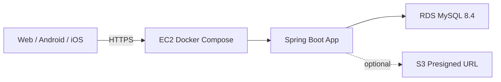
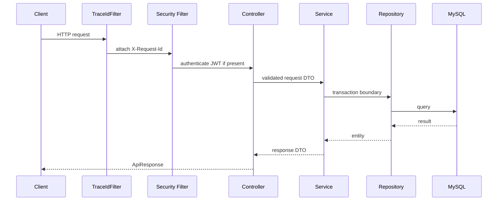
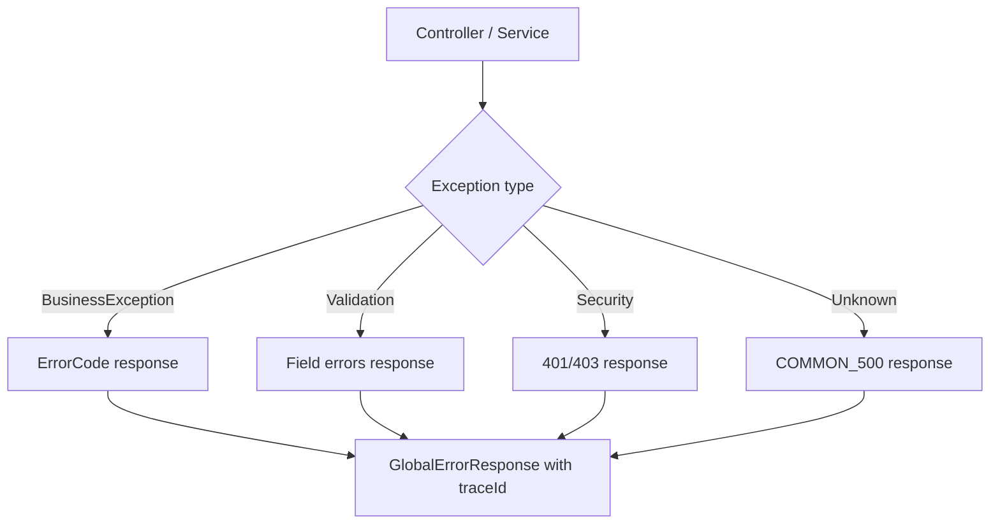

# Architecture

이 프로젝트는 1박2일 대학생 해커톤을 위한 Spring Boot 백엔드 템플릿이다. 핵심 판단 기준은 빠른 협업, 낮은 운영 복잡도, 평가자가 확인하기 쉬운 코드 완성도다.

## Decisions

| 항목 | 선택 | 이유 |
| --- | --- | --- |
| 모듈 구조 | 단일 Gradle module | 해커톤 초기에 multi-module은 빌드/패키지 이동 비용이 크다. |
| 패키지 | package-by-feature | 기능 단위로 찾기 쉽고 클라이언트 API와 매핑하기 쉽다. |
| Java | 21 LTS | 최신 LTS이고 로컬/CI/AWS에서 안정적으로 쓰기 좋다. |
| Spring Boot | 4.0.6 | 현재 stable 계열이며 Spring 7 기반 최신 스택이다. |
| DB | MySQL 8.4 LTS | 사용자가 익숙하고 RDS/로컬 Docker 구성이 단순하다. |
| Migration | Flyway | schema 변경 이력을 평가자가 확인할 수 있다. |
| Auth | 자체 로그인 + JWT | 주제 미정 상태에서도 대부분 서비스에 필요한 기반이다. |
| Refresh token | DB 저장 + rotation | Redis 없이도 재발급/로그아웃을 구현할 수 있다. |
| API docs | springdoc-openapi | 웹/모바일 팀과 계약을 맞추기 쉽다. |
| Infra | EC2 + Docker Compose + RDS | 짧은 해커톤에서 Kubernetes/Terraform보다 운영 리스크가 낮다. |

## Why Not Multi-Module First

multi-module은 도메인이 여러 개로 확정되고 팀원이 모듈 경계를 이해할 때 효과가 있다. 주제가 정해지기 전에는 다음 비용이 더 크다.

- 패키지 이동과 의존성 방향 관리 비용
- 테스트 설정 중복
- 초보 팀원의 탐색 난이도 상승
- 해커톤 중 급한 기능 추가 시 마찰 증가

대신 package-by-feature와 문서화된 layer rule로 시작한다. 기능이 커지면 `auth`, `member`, `file`, 핵심 도메인을 기준으로 나중에 module을 나눌 수 있다.

## Why MySQL

MySQL을 기본으로 둔 이유:

- 팀원이 이미 익숙할 가능성이 높다.
- RDS MySQL, Docker MySQL, 로컬 MySQL 간 전환이 단순하다.
- 해커톤의 일반적인 CRUD, 로그인, 목록, 검색 조건에는 충분하다.
- MySQL 8.4 LTS를 쓰면 장기 지원 기준을 설명하기 좋다.

PostgreSQL이 더 나을 수 있는 경우:

- JSONB를 적극적으로 쓴다.
- 전문 검색, 지리 정보, 복잡한 분석 쿼리가 중심이다.
- Supabase나 PostGIS 같은 생태계를 바로 활용해야 한다.

이번 템플릿은 사용자의 익숙함과 협업 속도를 우선해서 MySQL을 선택했다.

## Runtime Architecture

로컬에서는 Docker Compose가 MySQL을 띄우고, 앱은 로컬 JVM 또는 app container로 실행할 수 있다.

## Request Flow

## Error Flow

## Extension Points

| 필요 기능 | 확장 방법 |
| --- | --- |
| OAuth Kakao/Naver/Google | `auth` 아래 provider adapter를 추가하고 기존 JWT 발급 로직 재사용 |
| S3 upload | `file` 패키지 추가, presigned URL 발급 API 구현 |
| Admin API | `ROLE_ADMIN`과 `/api/v1/admin/**` 권한 규칙 사용 |
| Search | 초기에는 JPA query method/specification, 복잡해지면 QueryDSL 검토 |
| Caching | 트래픽 병목이 실제로 보이면 Redis 도입 |
| Async/event | 요구사항이 생기면 Spring event부터 검토, Kafka는 후순위 |

## Current Implemented Packages

- `global.response`: `ApiResponse`, `PageResponse`
- `global.error`: `ErrorCode`, `BusinessException`, `GlobalExceptionHandler`
- `global.security`: JWT provider, security config, current user resolver
- `auth`: sign-up, login, refresh, logout
- `member`: member entity and repository
- `example`: response/error contract sample API
