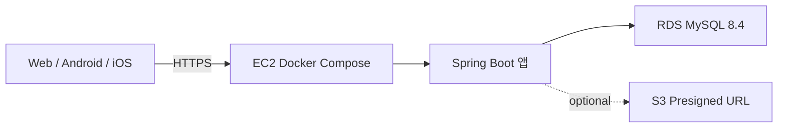
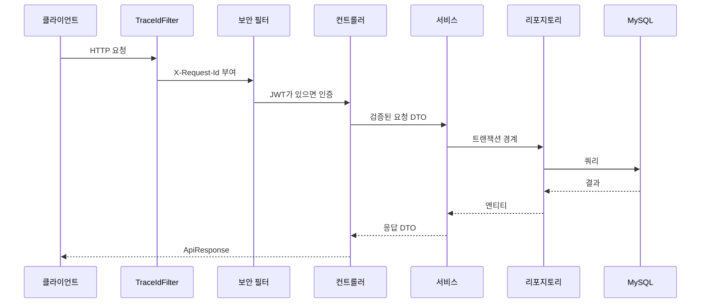
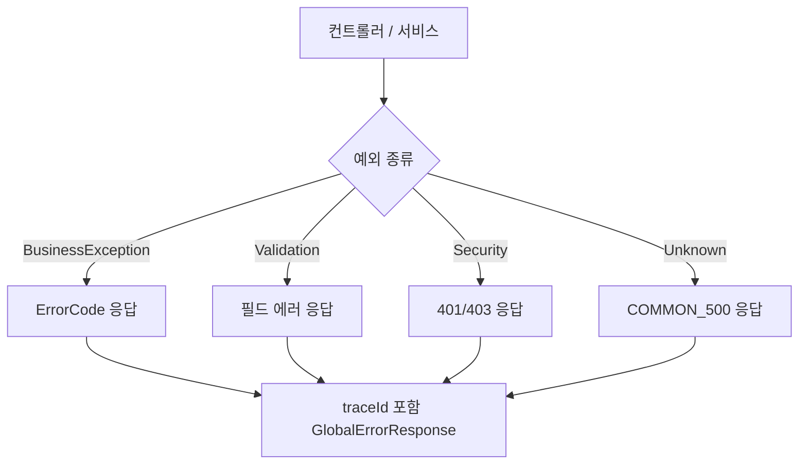

# 아키텍처

이 프로젝트는 해커톤을 위한 Spring Boot 백엔드 템플릿이다. 핵심 판단 기준은 빠른 협업, 낮은 운영 복잡도, 평가자가 확인하기 쉬운 코드 완성도다.

## 주요 선택

| 항목 | 선택 | 이유 |
| --- | --- | --- |
| 모듈 구조 | 단일 Gradle 모듈 | 해커톤 초기에 멀티 모듈은 빌드/패키지 이동 비용이 크다. |
| 패키지 | package-by-feature | 기능 단위로 찾기 쉽고 클라이언트 API와 매핑하기 쉽다. |
| Java | 21 LTS | 최신 LTS이고 로컬/CI/AWS에서 안정적으로 쓰기 좋다. |
| Spring Boot | 4.0.6 | 현재 stable 계열이며 Spring 7 기반 최신 스택이다. |
| DB | MySQL 8.4 LTS | 사용자가 익숙하고 RDS/로컬 Docker 구성이 단순하다. |
| 스키마 | Hibernate `ddl-auto`를 단계별 전환 | 초반 초기화, 데이터 보존, 제출 전 검증 기준은 [MVP 개발 가이드](../guides/mvp-development-guide.md)를 따른다. |
| 인증 | 자체 로그인 + 48시간 JWT 액세스 토큰 | 주제 미정 상태에서도 대부분 서비스에 필요한 기반이고, 리프레시 토큰 없이도 시연에는 충분하다. |
| API 문서 | springdoc-openapi | 웹/모바일 팀과 계약을 맞추기 쉽다. |
| 인프라 | EC2 + Docker Compose + RDS | 짧은 해커톤에서 Kubernetes/Terraform보다 운영 리스크가 낮다. |

## 선택 이유

처음부터 멀티 모듈로 나누지 않는다. 주제가 정해지기 전에는 패키지 이동, 의존성 방향, 테스트 설정 비용이 더 크다. 대신 기능별 패키지와 계층 규칙으로 시작하고, 기능이 커지면 `auth`, `member`, 핵심 도메인을 기준으로 나중에 모듈을 나눈다.

DB는 MySQL 8.4 LTS를 기본으로 둔다. 팀원이 익숙하고, RDS MySQL과 Docker MySQL 간 전환이 단순하며, 해커톤의 일반적인 CRUD/로그인/목록 요구에는 충분하다. JSONB, 전문 검색, 지리 정보가 핵심이면 PostgreSQL을 다시 검토한다.

## 런타임 구조

로컬에서는 Docker Compose가 MySQL을 띄우고, 앱은 로컬 JVM 또는 앱 컨테이너로 실행할 수 있다.

## 요청 흐름

## 에러 흐름

## 확장 지점

| 필요 기능 | 확장 방법 |
| --- | --- |
| MVP 공개 API 개발 | 인증 허용값 전환 기준은 [MVP 개발 가이드](../guides/mvp-development-guide.md)를 따른다. |
| 실서비스형 인증 | 액세스 토큰 만료 시간 단축, 리프레시 토큰 저장/폐기, 로그아웃 폐기 처리를 추가 |
| OAuth Kakao/Naver/Google | `auth` 아래 provider adapter를 추가하고 기존 JWT 발급 로직 재사용 |
| S3 업로드 | `file` 패키지 추가, presigned URL 발급 API 구현 |
| 관리자 API | `ROLE_ADMIN`과 `/api/v1/admin/**` 권한 규칙 사용 |
| 검색 | 초기에는 JPA query method로 해결하고, 주제가 복잡한 검색을 요구할 때만 범위를 다시 잡음 |
| 캐싱/비동기 | 해커톤 기본 범위에서는 제외하고, 실제 병목이나 요구사항이 보일 때 별도 설계 |

## 현재 구현된 패키지

- `global.response`: `ApiResponse`, `PageResponse`
- `global.error`: `ErrorCode`, `CommonErrorCode`, `BusinessException`, `GlobalExceptionHandler`
- `global.config`: OpenAPI/Swagger 설정
- `global.security`: JWT provider, 보안 설정, 현재 사용자 resolver, `SecurityErrorCode`
- `global.web`: 요청 trace id 필터
- `auth`: 회원가입, 로그인, 액세스 토큰 발급, `AuthErrorCode`
- `member`: 회원 엔티티와 리포지토리, `MemberErrorCode`
- `example`: 응답/에러 계약 샘플 API
